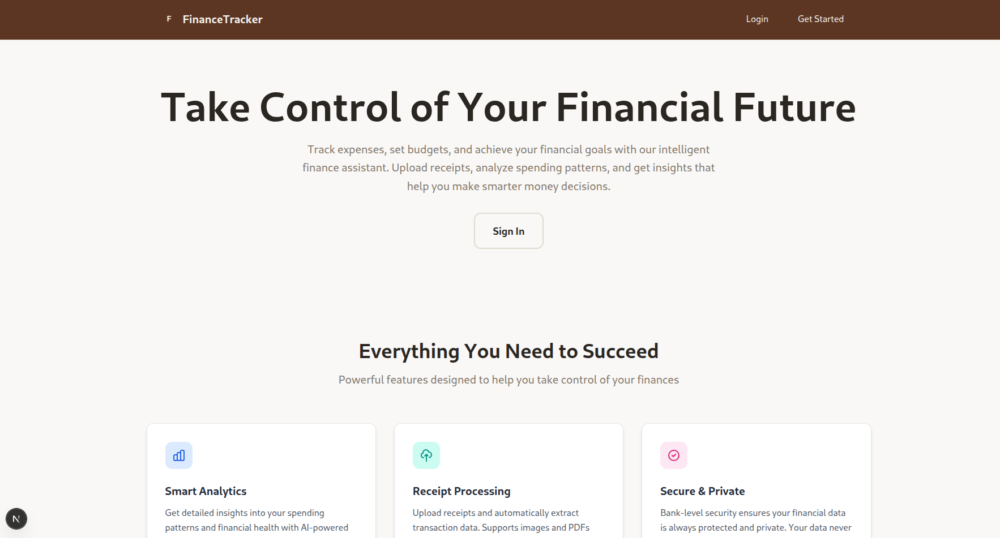
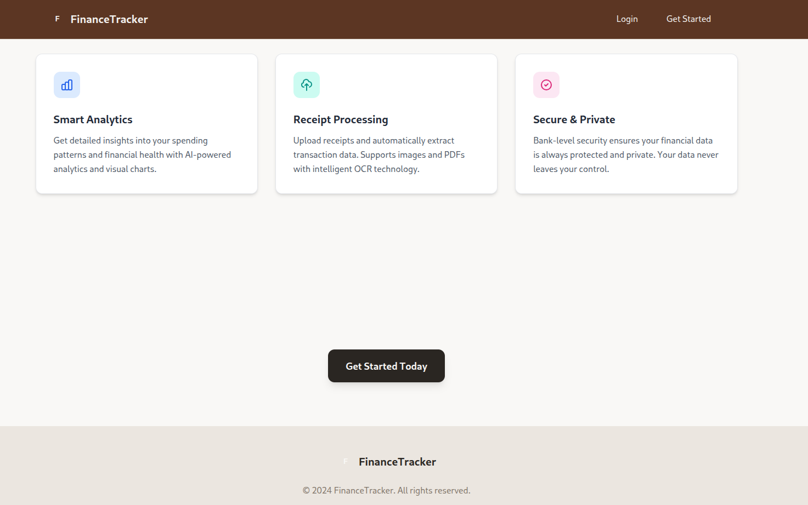
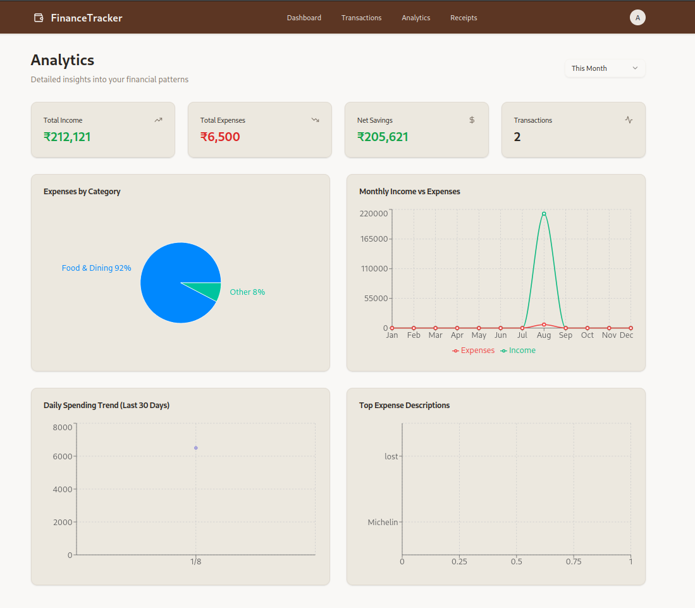
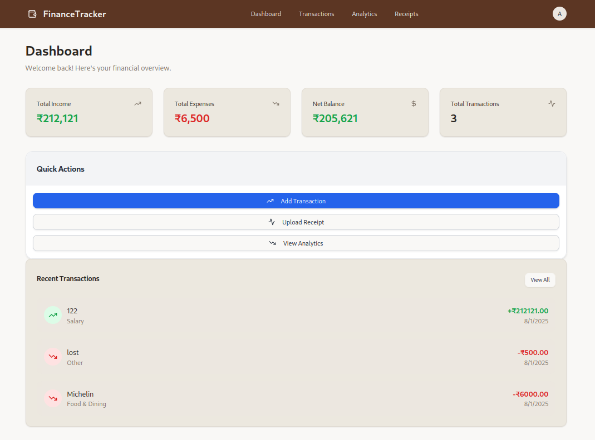
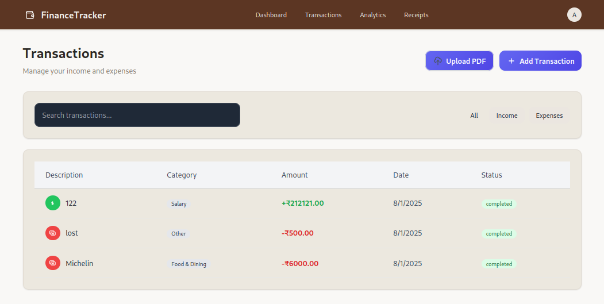
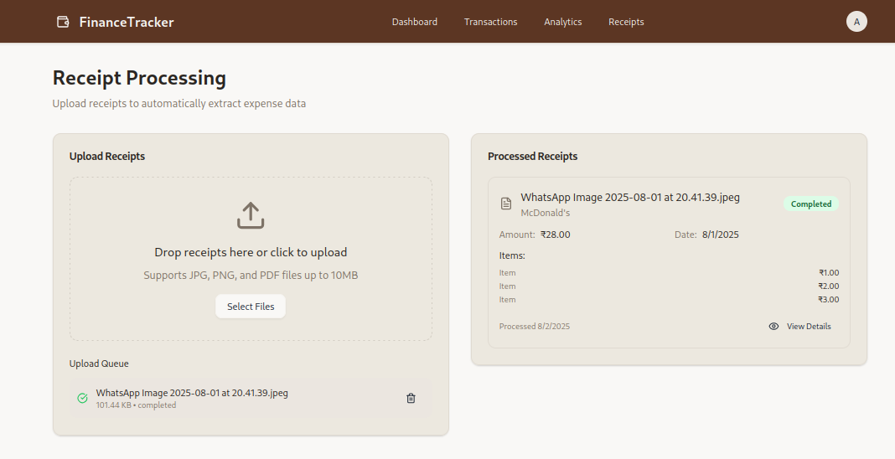

# FinanceTracker - Your Personal Finance Assistant

This is a simple yet powerful finance tracking application built to help you take control of your money. It's designed to be easy to use, with a clean and modern interface that lets you focus on what matters most: your financial goals.

## What's inside?

*   **Sleek Dashboard:** Get a quick overview of your income, expenses, and net balance.
*   **Easy Transaction Tracking:** Quickly add new transactions, categorize them, and see where your money is going.
*   **Smart Analytics:** See your spending patterns and get insights into your financial health.
*   **Secure and Private:** Your data is your own. This project uses secure authentication and keeps your financial information private.

## Screenshots

I'll be adding some screenshots here soon to show you what the app looks like in action!






## Getting Started

Ready to give it a try? Just follow these simple steps:

1.  **Clone the project:**
    ```bash
    git clone <repository-url>
    cd finance-assistant
    ```

2.  **Install the dependencies:**
    ```bash
    npm install
    ```

3.  **Set up your environment variables:**

    Copy the `.env.example` file to a new file called `.env.local`:
    ```bash
    cp .env.example .env.local
    ```

    Then, open `.env.local` and replace the placeholder values with your own MongoDB connection string.

4.  **Run the development server:**
    ```bash
    npm run dev
    ```

That's it! You can now open [http://localhost:3000](http://localhost:3000) in your browser to see the app.

## How it's built

This project is built with some of the latest web technologies:

*   **Next.js:** A powerful React framework for building fast and modern web applications.
*   **Tailwind CSS:** A utility-first CSS framework that makes it easy to create beautiful designs.
*   **MongoDB:** A flexible and scalable NoSQL database.
*   **JWT Authentication:** A secure way to handle user logins and protect your data.


## License

This project is licensed under the MIT License.